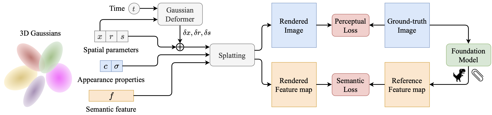

# DGD: Dynamic 3D Gaussians Distillation

Isaac Labe, Noam Issachar, Itai Lang, Sagie Benaim<br>
| [Webpage](https://isaaclabe.github.io/DGD-Website/) | [Full Paper](https://arxiv.org/pdf/2405.19321) | [arXiv](https://arxiv.org/abs/2405.19321) |

## Abstract
We tackle the task of learning dynamic 3D semantic radiance fields given a single monocular video as input. Our learned semantic radiance field captures per-point semantics as well as color and geometric properties for a dynamic 3D scene, enabling the generation of novel views and their corresponding semantics. This enables the segmentation and tracking of a diverse set of 3D semantic entities, specified using a simple and intuitive interface that includes a user click or a text prompt. To this end, we present DGD, a unified 3D representation for both the appearance and semantics of a dynamic 3D scene, building upon the recently proposed dynamic 3D Gaussians representation. Our representation is optimized over time with both color and semantic information. Key to our method is the joint optimization of the appearance and semantic attributes, which jointly affect the geometric properties of the scene. We evaluate our approach in its ability to enable dense semantic 3D object tracking and demonstrate high-quality results that are fast to render, for a diverse set of scenes.

## Pipeline




## Dataset

In our paper, we use:

- synthetic dataset from [D-NeRF](https://www.albertpumarola.com/research/D-NeRF/index.html).
- real-world dataset from [Hyper-NeRF](https://hypernerf.github.io/).

We organize the datasets as follows:

```shell
├── data
│   | D-NeRF 
│     ├── hook
│     ├── standup 
│     ├── ...
│   | HyperNeRF
│     ├── interp
│     ├── misc
│     ├── vrig
```

## Setup

### Environment

```shell
git clone https://github.com/Isaaclabe/DGD-Dynamic-3D-Gaussians-Distillation.git --recursive
cd DGD-Dynamic-3D-Gaussians-Distillation

conda create -n DGD_env python=3.7
conda activate DGD_env

# install pytorch
pip install torch==1.13.1+cu116 torchvision==0.14.1+cu116 --extra-index-url https://download.pytorch.org/whl/cu116

# install dependencies
pip install -q plyfile
pip install git+https://github.com/openai/CLIP.git
pip install timm
pip install -r requirements.txt
```

### Setup the submodules

To run the training and rendering code, you need to setup the rasterizer and the Lseg-CLIP model. This is done by using the following instruction,
```shell
# The following part setup the gaussian rasterizer module:

cd DGD-Dynamic-3D-Gaussians-Distillation/submodules/diff-gaussian-rasterization
python setup.py build_ext
mkdir DGD-Dynamic-3D-Gaussians-Distillation/diff_gaussian_rasterization
mv DGD-Dynamic-3D-Gaussians-Distillation/submodules/diff-gaussian-rasterization/build/lib.linux-x86_64-cpython-310/diff_gaussian_rasterization/_C.cpython-310-x86_64-linux-gnu.so DGD-Dynamic-3D-Gaussians-Distillation/diff_gaussian_rasterization
mv DGD-Dynamic-3D-Gaussians-Distillation/submodules/diff-gaussian-rasterization/diff_gaussian_rasterization/__init__.py DGD-Dynamic-3D-Gaussians-Distillation/diff_gaussian_rasterization

# The following part setup the simple knn module:

cd DGD-Dynamic-3D-Gaussians-Distillation/submodules/simple-knn
python setup_knn.py build_ext
mkdir DGD-Dynamic-3D-Gaussians-Distillation/simple_knn
mv DGD-Dynamic-3D-Gaussians-Distillation/submodules/simple-knn/build/lib.linux-x86_64-cpython-310/simple_knn/_C.cpython-310-x86_64-linux-gnu.so DGD-Dynamic-3D-Gaussians-Distillation/simple_knn

# The following part setup the Lseg module:

cd DGD-Dynamic-3D-Gaussians-Distillation/lseg_minimal
python setup.py build develop
rm -rf DGD-Dynamic-3D-Gaussians-Distillation/lseg_minimal/lseg
mv DGD-Dynamic-3D-Gaussians-Distillation/lseg_minimal/build/lib/lseg/ DGD-Dynamic-3D-Gaussians-Distillation/lseg_minimal
rm -rf DGD-Dynamic-3D-Gaussians-Distillation/lseg_minimal/build
```

## Train

### Use the DINOv2 foundation model

To run the optimizer using the DINOv2 foundation model, simply use

```shell
python train.py -s path/to/your/dataset -m output/exp-name --fundation_model "DINOv2" --semantic_dimension 384
```

<details>
<summary><span style="font-weight: bold;">Command Line Arguments for train.py</span></summary>
      
  #### --source_path / -s
  Path to the source directory containing a COLMAP or Synthetic NeRF data set.
  #### --model_path / -m 
  Path where the trained model should be stored (```output/<random>``` by default).
  #### --Lseg_model_path 
  The path where the pre-trained Lseg minimal model should be stored.
  #### --fundation_model
  The 2D foundation model used for semantic features. Options are ```"DINOv2"``` or ```"Lseg_CLIP"``` (```"DINOv2"``` by default).
  #### --semantic_dimension
  The dimension of the semantic feature, which is ```384``` for the DINOv2 model and ```512``` for the Lseg-CLIP model (```384``` by default).
  #### --loss_reduce
  The factor by which the semantic loss is reduced, calculated as ```loss = loss_color + loss_reduce * loss_semantic``` (```0.5``` by default).
  #### --semantic_start
  The iteration index at which semantic optimization begins (```25_000``` by default).
  #### --semantic_stop
  The iteration index at which semantic optimization stops (```40_000``` by default).
  #### --stop_MLP
  The iteration index at which MLP optimization stops, which should be equal to the ```semantic_start``` index (```25_000``` by default).
  #### --iterations
  The total number of iterations for training (```40_000``` by default).
  #### --warm_up
  The iteration index until which MLP optimization is paused at the beginning of the optimization (```3000``` by default).
  #### --images / -i
  Alternative subdirectory for COLMAP images (```images``` by default).
  #### --eval
  Add this flag to use a MipNeRF360-style training/test split for evaluation.
  #### --resolution / -r
  Specifies resolution of the loaded images before training. If provided ```1, 2, 4``` or ```8```, uses original, 1/2, 1/4 or 1/8 resolution, respectively. For all other values, rescales the width to the given number while maintaining image aspect. **If not set and input image width exceeds 1.6K pixels, inputs are automatically rescaled to this target.**
  #### --data_device
  Specifies where to put the source image data, ```cuda``` by default, recommended to use ```cpu``` if training on large/high-resolution dataset, will reduce VRAM consumption, but slightly slow down training. Thanks to [HrsPythonix](https://github.com/HrsPythonix).
  #### --white_background / -w
  Add this flag to use white background instead of black (default), e.g., for evaluation of NeRF Synthetic dataset.
  #### --sh_degree
  Order of spherical harmonics to be used (no larger than 3). ```3``` by default.
  #### --convert_SHs_python
  Flag to make pipeline compute forward and backward of SHs with PyTorch instead of ours.
  #### --convert_cov3D_python
  Flag to make pipeline compute forward and backward of the 3D covariance with PyTorch instead of ours.
  #### --debug
  Enables debug mode if you experience erros. If the rasterizer fails, a ```dump``` file is created that you may forward to us in an issue so we can take a look.
  #### --debug_from
  Debugging is **slow**. You may specify an iteration (starting from 0) after which the above debugging becomes active.
  #### --ip
  IP to start GUI server on, ```127.0.0.1``` by default.
  #### --port 
  Port to use for GUI server, ```6009``` by default.
  #### --test_iterations
  Space-separated iterations at which the training script computes L1 and PSNR over test set, ```7000 30000``` by default.
  #### --save_iterations
  Space-separated iterations at which the training script saves the Gaussian model, ```7000 30000 <iterations>``` by default.
  #### --checkpoint_iterations
  Space-separated iterations at which to store a checkpoint for continuing later, saved in the model directory.
  #### --start_checkpoint
  Path to a saved checkpoint to continue training from.
  #### --quiet 
  Flag to omit any text written to standard out pipe. 
  #### --feature_lr
  Spherical harmonics features learning rate, ```0.0025``` by default.
  #### --opacity_lr
  Opacity learning rate, ```0.05``` by default.
  #### --scaling_lr
  Scaling learning rate, ```0.005``` by default.
  #### --rotation_lr
  Rotation learning rate, ```0.001``` by default.
  #### --position_lr_max_steps
  Number of steps (from 0) where position learning rate goes from ```initial``` to ```final```. ```30_000``` by default.
  #### --position_lr_init
  Initial 3D position learning rate, ```0.00016``` by default.
  #### --position_lr_final
  Final 3D position learning rate, ```0.0000016``` by default.
  #### --position_lr_delay_mult
  Position learning rate multiplier (cf. Plenoxels), ```0.01``` by default. 
  #### --densify_from_iter
  Iteration where densification starts, ```500``` by default. 
  #### --densify_until_iter
  Iteration where densification stops, ```15_000``` by default.
  #### --densify_grad_threshold
  Limit that decides if points should be densified based on 2D position gradient, ```0.0002``` by default.
  #### --densification_interval
  How frequently to densify, ```100``` (every 100 iterations) by default.
  #### --opacity_reset_interval
  How frequently to reset opacity, ```3_000``` by default. 
  #### --lambda_dssim
  Influence of SSIM on total loss from 0 to 1, ```0.2``` by default. 
  #### --percent_dense
  Percentage of scene extent (0--1) a point must exceed to be forcibly densified, ```0.01``` by default.

</details>
<br>

### Use the Lseg-CLIP foundation model

To run the optimizer using the Lseg-CLIP foundation model, first download the pre-trained Lseg minimal network model from [this link](https://huggingface.co/IsaacLabe/Lseg_minimal_model). Once downloaded, you can proceed with the optimizer

```shell
python train.py -s path/to/your/dataset -m output/exp-name --Lseg_model_path path/to/your/Lseg-model --fundation_model "Lseg_CLIP" --semantic_dimension 512 --loss_reduce 10
```

<details>
<summary><span style="font-weight: bold;">Command Line Arguments for train.py</span></summary>
      
  #### --source_path / -s
  Path to the source directory containing a COLMAP or Synthetic NeRF data set.
  #### --model_path / -m 
  Path where the trained model should be stored (```output/<random>``` by default).
  #### --Lseg_model_path 
  The path where the pre-trained Lseg minimal model should be stored.
  #### --fundation_model
  The 2D foundation model used for semantic features. Options are ```"DINOv2"``` or ```"Lseg_CLIP"``` (```"DINOv2"``` by default).
  #### --semantic_dimension
  The dimension of the semantic feature, which is ```384``` for the DINOv2 model and ```512``` for the Lseg-CLIP model (```384``` by default).
  #### --loss_reduce
  The factor by which the semantic loss is reduced, calculated as ```loss = loss_color + loss_reduce * loss_semantic``` (```0.5``` by default).
  #### --semantic_start
  The iteration index at which semantic optimization begins (```25_000``` by default).
  #### --semantic_stop
  The iteration index at which semantic optimization stops (```40_000``` by default).
  #### --stop_MLP
  The iteration index at which MLP optimization stops, which should be equal to the ```semantic_start``` index (```25_000``` by default).
  #### --iterations
  The total number of iterations for training (```40_000``` by default).
  #### --warm_up
  The iteration index until which MLP optimization is paused at the beginning of the optimization (```3000``` by default).
  #### --images / -i
  Alternative subdirectory for COLMAP images (```images``` by default).
  #### --eval
  Add this flag to use a MipNeRF360-style training/test split for evaluation.
  #### --resolution / -r
  Specifies resolution of the loaded images before training. If provided ```1, 2, 4``` or ```8```, uses original, 1/2, 1/4 or 1/8 resolution, respectively. For all other values, rescales the width to the given number while maintaining image aspect. **If not set and input image width exceeds 1.6K pixels, inputs are automatically rescaled to this target.**
  #### --data_device
  Specifies where to put the source image data, ```cuda``` by default, recommended to use ```cpu``` if training on large/high-resolution dataset, will reduce VRAM consumption, but slightly slow down training. Thanks to [HrsPythonix](https://github.com/HrsPythonix).
  #### --white_background / -w
  Add this flag to use white background instead of black (default), e.g., for evaluation of NeRF Synthetic dataset.
  #### --sh_degree
  Order of spherical harmonics to be used (no larger than 3). ```3``` by default.
  #### --convert_SHs_python
  Flag to make pipeline compute forward and backward of SHs with PyTorch instead of ours.
  #### --convert_cov3D_python
  Flag to make pipeline compute forward and backward of the 3D covariance with PyTorch instead of ours.
  #### --debug
  Enables debug mode if you experience erros. If the rasterizer fails, a ```dump``` file is created that you may forward to us in an issue so we can take a look.
  #### --debug_from
  Debugging is **slow**. You may specify an iteration (starting from 0) after which the above debugging becomes active.
  #### --ip
  IP to start GUI server on, ```127.0.0.1``` by default.
  #### --port 
  Port to use for GUI server, ```6009``` by default.
  #### --test_iterations
  Space-separated iterations at which the training script computes L1 and PSNR over test set, ```7000 30000``` by default.
  #### --save_iterations
  Space-separated iterations at which the training script saves the Gaussian model, ```7000 30000 <iterations>``` by default.
  #### --checkpoint_iterations
  Space-separated iterations at which to store a checkpoint for continuing later, saved in the model directory.
  #### --start_checkpoint
  Path to a saved checkpoint to continue training from.
  #### --quiet 
  Flag to omit any text written to standard out pipe. 
  #### --feature_lr
  Spherical harmonics features learning rate, ```0.0025``` by default.
  #### --opacity_lr
  Opacity learning rate, ```0.05``` by default.
  #### --scaling_lr
  Scaling learning rate, ```0.005``` by default.
  #### --rotation_lr
  Rotation learning rate, ```0.001``` by default.
  #### --position_lr_max_steps
  Number of steps (from 0) where position learning rate goes from ```initial``` to ```final```. ```30_000``` by default.
  #### --position_lr_init
  Initial 3D position learning rate, ```0.00016``` by default.
  #### --position_lr_final
  Final 3D position learning rate, ```0.0000016``` by default.
  #### --position_lr_delay_mult
  Position learning rate multiplier (cf. Plenoxels), ```0.01``` by default. 
  #### --densify_from_iter
  Iteration where densification starts, ```500``` by default. 
  #### --densify_until_iter
  Iteration where densification stops, ```15_000``` by default.
  #### --densify_grad_threshold
  Limit that decides if points should be densified based on 2D position gradient, ```0.0002``` by default.
  #### --densification_interval
  How frequently to densify, ```100``` (every 100 iterations) by default.
  #### --opacity_reset_interval
  How frequently to reset opacity, ```3_000``` by default. 
  #### --lambda_dssim
  Influence of SSIM on total loss from 0 to 1, ```0.2``` by default. 
  #### --percent_dense
  Percentage of scene extent (0--1) a point must exceed to be forcibly densified, ```0.01``` by default.

</details>
<br>

## Render

### Use the DINOv2 foundation model

To render the segmentation using the DINOv2 foundation model, simply use

```shell
python render.py -s path/to/your/dataset -m output/exp-name --fundation_model "DINOv2" --semantic_dimension 384 --iterations 40_000 --frame k --novel_views i --points "(x1,y1)" "(x2,y2)" --thetas "ϴ1" "ϴ2"
```

<details>
<summary><span style="font-weight: bold;">Command Line Arguments for render.py</span></summary>
      
  #### --source_path / -s
  Path to the source directory containing a COLMAP or Synthetic NeRF data set.
  #### --model_path / -m 
  Path where the trained model should be stored (```output/<random>``` by default).
  #### --Lseg_model_path 
  The path where the pre-trained Lseg minimal model should be stored.
  #### --fundation_model
  The 2D foundation model used for semantic features. Options are ```"DINOv2"``` or ```"Lseg_CLIP"``` (```"DINOv2"``` by default).
  #### --semantic_dimension
  The dimension of the semantic feature, which is ```384``` for the DINOv2 model and ```512``` for the Lseg-CLIP model (```384``` by default).
  #### --iterations
  The total number of iterations for training (```40_000``` by default).
  #### --frame
  Specifies the number of training frames in the dataset.
  #### --novel_views
  Command to choose whether to render novel views or training views: if ```novel_views = -1```, training views are rendered; if ```novel_views = index_of_novel_view```, the novel view with the specified index is rendered.
  #### --points
  A list of tuples ```(x, y)``` representing the coordinates of pixels in the first training frame (similar to clicking on the image).
  #### --thetas
  A list of thresholds (```float```) corresponding to the list of points, used to control the granularity of the segmentation.
  #### --prompt
  Text prompt for the Lseg-CLIP segmentation.
  
</details>
<br>

### Use the Lseg-CLIP foundation model

To render the segentation using the Lseg-CLIP foundation model, first download the pre-trained Lseg minimal network model from [this link](https://huggingface.co/IsaacLabe/Lseg_minimal_model). Once downloaded, you can proceed with the renderer

```shell
python render.py -s path/to/your/dataset -m output/exp-name --Lseg_model_path path/to/your/Lseg-model --fundation_model "Lseg_CLIP" --semantic_dimension 512  --iterations 40_000 --frame k --novel_views i --prompt "text" --thetas "ϴ"
```

<details>
<summary><span style="font-weight: bold;">Command Line Arguments for render.py</span></summary>
      
  #### --source_path / -s
  Path to the source directory containing a COLMAP or Synthetic NeRF data set.
  #### --model_path / -m 
  Path where the trained model should be stored (```output/<random>``` by default).
  #### --Lseg_model_path 
  The path where the pre-trained Lseg minimal model should be stored.
  #### --fundation_model
  The 2D foundation model used for semantic features. Options are ```"DINOv2"``` or ```"Lseg_CLIP"``` (```"DINOv2"``` by default).
  #### --semantic_dimension
  The dimension of the semantic feature, which is ```384``` for the DINOv2 model and ```512``` for the Lseg-CLIP model (```384``` by default).
  #### --iterations
  The total number of iterations for training (```40_000``` by default).
  #### --frame
  Specifies the number of training frames in the dataset.
  #### --novel_views
  Command to choose whether to render novel views or training views: if ```novel_views = -1```, training views are rendered; if ```novel_views = index_of_novel_view```, the novel view with the specified index is rendered.
  #### --points
  A list of tuples ```(x, y)``` representing the coordinates of pixels in the first training frame (similar to clicking on the image).
  #### --thetas
  A list of thresholds (```float```) corresponding to the list of points, used to control the granularity of the segmentation.
  #### --prompt
  Text prompt for the Lseg-CLIP segmentation.
  
</details>
<br>

## Run the code easily

To simplify training and rendering with this repository, I created a Colab file: ```DGD-Dynamic-3D-Gaussians-Distillation.ipynb```, which can be easily loaded and launched. I recommend using an A100 GPU to significantly reduce computation time during the runs.

## BibTex

```bibtex
@misc{labe2024dgd,
      title={DGD: Dynamic 3D Gaussians Distillation}, 
      author={Isaac Labe and Noam Issachar and Itai Lang and Sagie Benaim},
      year={2024},
      eprint={2405.19321},
      archivePrefix={arXiv},
      primaryClass={cs.CV}
}
```

## Acknowledgement

Our repo is developed based on [3D Gaussian Splatting](https://repo-sam.inria.fr/fungraph/3d-gaussian-splatting/), [DFFs](https://github.com/pfnet-research/distilled-feature-fields), [lseg-minimal](https://github.com/krrish94/lseg-minimal?tab=readme-ov-file) and [Deformable 3D Gaussians](https://ingra14m.github.io/Deformable-Gaussians/). Many thanks to the authors for opensoucing the codebase.
